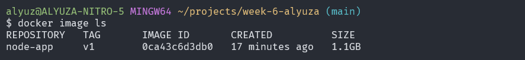

<!-- [](https://classroom.github.com/a/nj7iw4Wb) -->
# Docker
What is Docker and why it is used?
Docker lets you build, test, and deploy applications quickly

Using Docker, you can quickly deploy and scale applications into any environment and know your code will run. Running Docker on AWS provides developers and admins a highly reliable, low-cost way to build, ship, and run distributed applications at any scale.

### Docker Image
A Docker image is a file used to execute code in a Docker container. Docker images act as a set of instructions to build a Docker container, like a template. Docker images also act as the starting point when using Docker. An image is comparable to a snapshot in virtual machine (VM) environments.

### Docker Container
A container is an isolated environment for your code. This means that a container has no knowledge of your operating system, or your files. It runs on the environment provided to you by Docker Desktop. This is why a container usually has everything that your code needs in order to run, down to a base operating system.

## Docker and WSL Installation
1. Install Docker based on your Operating system here : [Docker Website](https://www.docker.com/)
2. After the installation done, you can check docker version in terminal/command prompt using `docker --version`:
    ```
    PS C:\Users\alyuz> docker --version
    Docker version 24.0.2, build cb74dfc
    ```

    If you use windows you need to install WSL (Windows subsytem for Linux)
    ```
    # Install WSL
    wsl --install

    # Update WSL
    wsl --update
    ```
    

## Creating Node.js app
First, create a new directory where all the files would live. In this directory create a package.json file that describes your app and its dependencies:
```bash
  
{
  "name": "docker_web_app",
  "version": "1.0.0",
  "description": "Node.js on Docker",
  "author": "First Last <first.last@example.com>",
  "main": "server.js",
  "scripts":
  {
    "start": "node server.js"
  },
  "dependencies":
  {
    "express": "^4.18.2"
  }
}

```
With your new package.json file, run `npm install`. If you are using npm version 5 or later, this will generate a `package-lock.json` file which will be copied to your Docker image.

Then, create a `app.js` copy from https://gist.github.com/berdoezt/e51718982926f0caa3fcd8ed45111430 :

```bash
const http = require('http');

const hostname = '0.0.0.0';
const port = 3001;

const server = http.createServer((req, res) => {
  res.statusCode = 200;
  res.setHeader('Content-Type', 'text/plain');
  res.end('Hello World');
});

server.listen(port, hostname, () => {
  console.log(`Server running at http://${hostname}:${port}/`);
});
```
## Creating a Docker file
Open the Dockerfile in your favorite text editor

The first thing we need to do is define from what image we want to build from. Here we will use the latest LTS (long term support) version 18 of node available from the [Docker Hub](https://hub.docker.com/_/node):
```bash
FROM node:18
```
Next we create a directory to hold the application code inside the image, this will be the working directory for your application:

```bash
# Create app directory
WORKDIR app
```
This image comes with Node.js and NPM already installed so the next thing we need to do is to install your app dependencies using the `npm` binary. Please note that if you are using `npm` version 4 or earlier a `package-lock.json` file will not be generated.


```bash
# Install app dependencies
# A wildcard is used to ensure both package.json AND package-lock.json are copied
# where available (npm@5+)
COPY package*.json ./

RUN npm install
# If you are building your code for production
# RUN npm ci --omit=dev
```

To bundle your app's source code inside the Docker image, use the COPY instruction:

```bash
# Bundle app source
COPY . .
```

Your app binds to port `3001` so you'll use the EXPOSE instruction to have it mapped by the `docker` daemon:

```bash
EXPOSE 3001
```

Define the command to run your app using CMD which defines your runtime. Here we will use node app.js to start your server:

```bash
CMD [ "node", "app.js" ]
```
Your Dockerfile should now look like this:

```bash
FROM node:18

# Create app directory
WORKDIR app

# Install app dependencies
# A wildcard is used to ensure both package.json AND package-lock.json are copied
# where available (npm@5+)
COPY package*.json ./

RUN npm install
# If you are building your code for production
# RUN npm ci --omit=dev

# Bundle app source
COPY . .

EXPOSE 3001

CMD [ "node", "app.js" ]
```

## Building the Image
Go to the directory that has your `Dockerfile` and run the following command to build the Docker image. The `-t` flag lets you tag your image so it's easier to find later using the `docker images` command:

`docker build . -t <your username>/node-app`

In this project I use

`docker build . -t node-app:v1`





## Run the Image

Running your image with `-d` runs the container in detached mode, leaving the container running in the background. The `-p` flag redirects a public port to a private port inside the container. Run the image you previously built:

```bash
docker run -d -p 3001:3001 node-app
```

## Test
